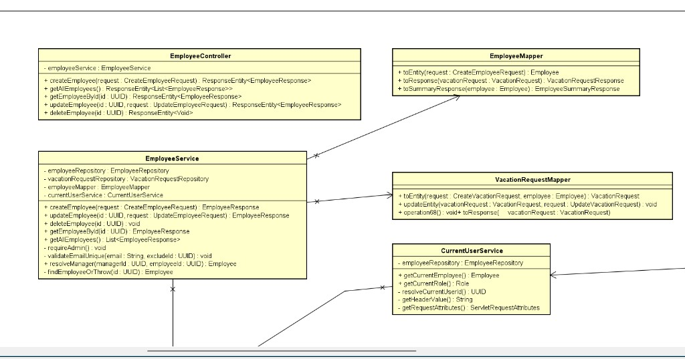
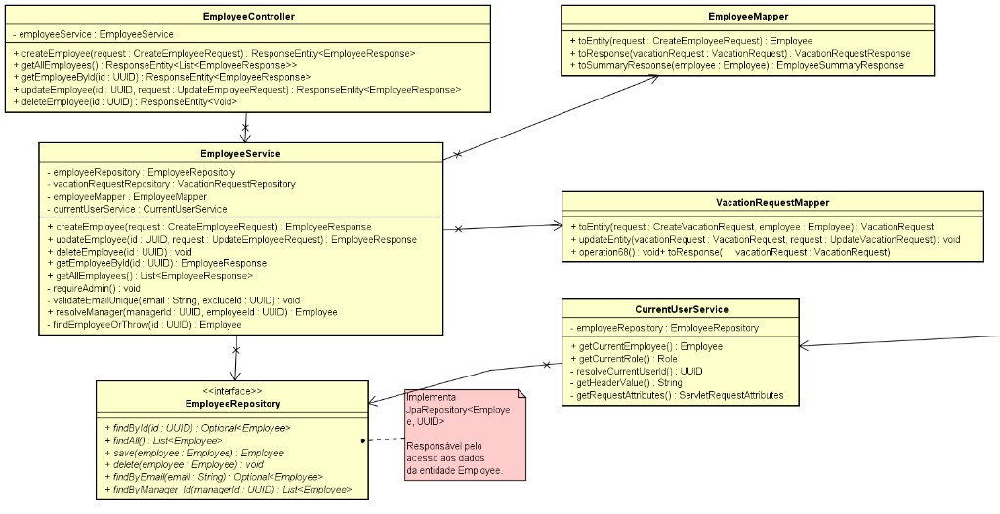
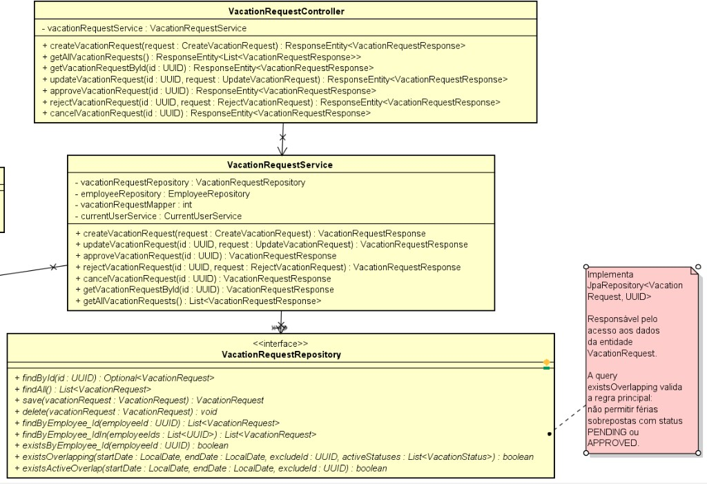
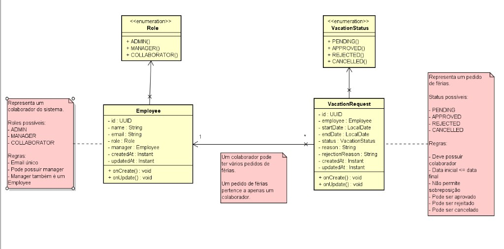

<div align="center">

# ProjetoLBC — Sistema de Gestão de Férias

Aplicação full-stack para a **gestão de colaboradores e pedidos de férias**, com prevenção de **sobreposição global de férias** e controlo de acesso baseado em perfis (ADMIN, MANAGER, COLLABORATOR).


### Links rápidos

[](https://projeto-lbc.vercel.app)
[](https://projetolbc-backend.onrender.com)
[](https://hub.docker.com/r/williamsartijose182/projetolbc-backend)
[](https://hub.docker.com/r/williamsartijose182/projetolbc-frontend)
[](https://www.figma.com/design/MziEDJuxHJBGJm0fzJ6BpF/Untitled?node-id=1-1051&t=gRvLKXZZYvZE5Fhe-1)
[](https://github.com/williamsartijose/ProjetoLBC)

</div>

---

## 1. Sobre o Projeto

### Objetivo

O **ProjetoLBC** é um Sistema de Gestão de Férias que permite registar colaboradores, gerir a sua hierarquia (managers) e tratar todo o ciclo de vida dos pedidos de férias — criação, edição, aprovação, rejeição e cancelamento.

### Problema que resolve

Numa organização, várias pessoas podem solicitar férias em simultâneo, gerando conflitos de cobertura. O sistema impõe uma **regra de sobreposição global**: não podem existir dois pedidos com datas sobrepostas enquanto ambos estiverem em estado `PENDING` ou `APPROVED`, independentemente do colaborador. Pedidos `REJECTED` e `CANCELLED` não bloqueiam o calendário.

### Público-alvo

Equipas de Recursos Humanos, managers e colaboradores que necessitam de um fluxo controlado e auditável de aprovação de férias.

### Arquitetura geral

- **Frontend** — SPA em React + Vite + TypeScript, com Material UI, consumindo a API REST.
- **Backend** — API REST em Spring Boot 3 (Java 21), organizada em camadas (Controller → Service → Repository), com mappers DTO ⇄ entidade e tratamento global de erros.
- **Base de dados** — PostgreSQL, com versionamento de schema via Flyway.
- **Autenticação simulada** — o utilizador ativo é identificado pelo header HTTP `X-User-Id` (sem login real nesta fase).

---

## 2. Demonstração

| Recurso | URL |
|--------|-----|
| Frontend (Vercel) | https://projeto-lbc.vercel.app |
| Backend (Render) | https://projetolbc-backend.onrender.com |
| Health check | https://projetolbc-backend.onrender.com/api/health |
| Swagger UI | https://projetolbc-backend.onrender.com/swagger-ui.html |
| OpenAPI JSON | https://projetolbc-backend.onrender.com/v3/api-docs |

> O backend expõe documentação **Swagger / OpenAPI** através do `springdoc-openapi`. Os caminhos `/swagger-ui.html` e `/v3/api-docs` estão configurados em `backend/src/main/resources/application.yml`.

---

## 3. Tecnologias

| Camada | Tecnologias |
|--------|-------------|
| **Frontend** | React 18, Vite 5, TypeScript 5, Material UI 6, React Router 6, Axios, TanStack Query 5 |
| **Backend** | Java 21, Spring Boot 3.4.5 (Web, Data JPA, Validation), Lombok, springdoc-openapi 2.8.6 |
| **Base de dados** | PostgreSQL |
| **Migrations** | Flyway (`flyway-core`, `flyway-database-postgresql`) |
| **Build** | Maven (backend), npm/Vite (frontend) |
| **Documentação API** | Swagger / OpenAPI |
| **Docker** | Dockerfiles multi-stage (backend e frontend), nginx, Docker Compose |
| **Deploy** | Vercel (frontend), Render (backend + PostgreSQL), Docker Hub (imagens) |
| **Versionamento** | Git, GitHub |

---

## 4. Arquitetura do Projeto

```
ProjetoLBC/
├── frontend/            # SPA React + Vite + TypeScript (Material UI)
├── backend/             # API REST Spring Boot (Java 21)
├── docs/                # Documentação técnica e diagramas UML
├── docker-compose.yml   # Orquestração: postgres + backend + frontend
└── README.md
```

| Pasta / Ficheiro | Descrição |
|------------------|-----------|
| `frontend/` | Aplicação React + Vite. Inclui páginas (Painel, Colaboradores, Pedidos de Férias, Relatórios, Configurações), componentes reutilizáveis, contexto de utilizador ativo, integração com a API via Axios + TanStack Query. |
| `backend/` | API Spring Boot organizada em `controller`, `service`, `repository`, `domain` (entidades/enums), `dto`, `mapper`, `exception` e `config`. |
| `docs/` | `ARCHITECTURE.md`, `DATABASE.md`, `CLASS_DIAGRAM.md`, `FLOWS.md`, `GIT_STRATEGY.md` e diagramas UML em `docs/uml/`. |
| `docker-compose.yml` | Define os serviços `postgres`, `backend` e `frontend` para execução local containerizada. |

### Estrutura do backend

```
backend/src/main/java/com/lbc/vacation/
├── VacationManagementApplication.java
├── config/        # CorsConfig
├── controller/    # HealthController, EmployeeController, VacationRequestController
├── service/       # EmployeeService, VacationRequestService, CurrentUserService
├── repository/    # EmployeeRepository, VacationRequestRepository
├── domain/        # entity (Employee, VacationRequest) + enums (Role, VacationStatus)
├── dto/           # Requests/Responses + ErrorResponse + HealthResponse
├── mapper/        # EmployeeMapper, VacationRequestMapper
└── exception/     # Exceções de domínio + GlobalExceptionHandler
```

### Estrutura do frontend

```
frontend/src/
├── components/    # dashboard/, reports/, settings/, notifications/
├── context/       # CurrentUserContext (utilizador ativo via X-User-Id)
├── features/      # employees/, vacationRequests/, dashboard/, reports/, notifications/
├── layout/        # MainLayout, Sidebar, Topbar
├── lib/           # apiClient (Axios), queryClient, formatDate, apiError
├── pages/         # PainelPage, ColaboradoresPage, PedidosFeriasPage, RelatoriosPage, ConfiguracoesPage
├── routes/        # AppRoutes, paths
└── theme/         # theme.ts (design system Material UI)
```

---

## 5. Arquitetura de Deploy

```
            Utilizador (Browser)
                    │
                    ▼
   ┌─────────────────────────────────┐
   │  Vercel — Frontend (SPA)         │
   │  React + Vite                    │
   │  https://projeto-lbc.vercel.app  │
   └─────────────────────────────────┘
                    │  HTTPS  →  /api/**
                    ▼
   ┌─────────────────────────────────────────┐
   │  Render — Backend (Docker)               │
   │  Spring Boot 3 / Java 21                 │
   │  https://projetolbc-backend.onrender.com │
   └─────────────────────────────────────────┘
                    │  JDBC
                    ▼
   ┌─────────────────────────────────┐
   │  Render — PostgreSQL             │
   │  Migrations geridas pelo Flyway  │
   └─────────────────────────────────┘
```

**Fluxo completo:**

1. O utilizador acede ao **frontend** publicado na **Vercel**.
2. A SPA chama a **API REST** publicada no **Render**, enviando o header `X-User-Id` para simular o utilizador autenticado. O CORS do backend autoriza a origem `https://projeto-lbc.vercel.app` (e `http://localhost:5173` em desenvolvimento).
3. O backend executa as regras de negócio e comunica com o **PostgreSQL** (Render) via JDBC.
4. Na primeira inicialização, o **Flyway** aplica automaticamente as migrations, criando o schema e os utilizadores de teste.

> Em execução local via Docker Compose, o frontend é servido por **nginx**, que reencaminha `/api` para o serviço `backend` na rede interna do Compose (mesma origem).

---

## 6. Design System

O design foi concebido no **Figma** antes da implementação do frontend, definindo o design system (cores, tipografia, componentes, espaçamentos) e os fluxos de navegação.

🔗 **Figma:** https://www.figma.com/design/MziEDJuxHJBGJm0fzJ6BpF/Untitled?node-id=1-1051&t=gRvLKXZZYvZE5Fhe-1

O desenvolvimento do frontend foi baseado nesta prototipação, garantindo consistência visual. A interface está integralmente em **Português de Portugal**. O design system está materializado em `frontend/src/theme/theme.ts` (cor primária `#2563EB`, fundo `#F8FAFC`, sidebar `#0F172A`, raio de borda `12px`).

---

## 7. Modelação UML

Antes da codificação, foi realizada uma modelação **UML (Astah UML)** para definir entidades, relacionamentos, regras de negócio e responsabilidades das camadas.

### Complete Backend Architecture


Visão geral da arquitetura: Controllers, Services, Repositories, Mappers, Domain Model, Enums e respetivos relacionamentos.

### Employee Module


Gestão de colaboradores e hierarquia de managers: `EmployeeController`, `EmployeeService`, `EmployeeRepository`, `EmployeeMapper` e `CurrentUserService`.

### Vacation Request Module


Ciclo de vida dos pedidos de férias: `VacationRequestController`, `VacationRequestService`, `VacationRequestRepository` (com a query de sobreposição global) e `VacationRequestMapper`.

### Domain Model


Entidades `Employee` e `VacationRequest`, enums `Role` e `VacationStatus`, e relacionamentos: `Employee (1) — (*) VacationRequest` e o auto-relacionamento `Employee (Manager) (1) — (*) Employee`.

> Documentação técnica adicional disponível em `docs/` (`ARCHITECTURE.md`, `DATABASE.md`, `CLASS_DIAGRAM.md`, `FLOWS.md`, `GIT_STRATEGY.md`).

---

## 8. Docker

O projeto inclui **Dockerfiles multi-stage** para backend e frontend, seguindo boas práticas de produção (imagens finais reduzidas, utilizador não-root no backend, nginx no frontend).

### Dockerização do Backend

`backend/Dockerfile` — compila com Maven + JDK 21 e executa apenas com o JRE Alpine.

```dockerfile
# Stage 1 - Build (Maven + JDK 21)
FROM maven:3.9-eclipse-temurin-21 AS build
WORKDIR /app
COPY pom.xml .
RUN mvn -B dependency:go-offline
COPY src ./src
RUN mvn -B clean package -DskipTests

# Stage 2 - Runtime (apenas JRE)
FROM eclipse-temurin:21-jre-alpine AS runtime
WORKDIR /app
RUN addgroup -S app && adduser -S app -G app
COPY --from=build /app/target/*.jar app.jar
RUN chown -R app:app /app
USER app
ENV SPRING_PROFILES_ACTIVE=docker
ENV JAVA_OPTS=""
EXPOSE 8080
ENTRYPOINT ["sh", "-c", "java $JAVA_OPTS -jar app.jar"]
```

**Funcionamento:** o *stage* de build aproveita o cache de dependências (copia o `pom.xml` antes do código). O artefacto final corre num container leve com JRE, como utilizador não-root, expondo a porta **8080** e ativando o profile `docker`.

### Dockerização do Frontend

`frontend/Dockerfile` — compila a aplicação Vite e serve os estáticos com **nginx**, com fallback de SPA e proxy para a API.

```dockerfile
# Stage 1 - Build (Node + Vite)
FROM node:20-alpine AS build
WORKDIR /app
COPY package*.json ./
RUN npm ci
COPY . .
ARG VITE_API_BASE_URL=""
ENV VITE_API_BASE_URL=$VITE_API_BASE_URL
RUN npm run build

# Stage 2 - Serve (nginx, SPA + proxy)
FROM nginx:1.27-alpine AS runtime
ENV BACKEND_URL=http://backend:8080
COPY nginx/default.conf.template /etc/nginx/templates/default.conf.template
COPY --from=build /app/dist /usr/share/nginx/html
EXPOSE 80
CMD ["nginx", "-g", "daemon off;"]
```

**Funcionamento:** com `VITE_API_BASE_URL` vazio, a aplicação usa caminhos relativos (`/api`). O nginx serve os estáticos, faz **SPA fallback** (`try_files ... /index.html`) e reencaminha `/api` para o backend (`${BACKEND_URL}`), eliminando problemas de CORS em execução local.

---

## 9. Docker Hub

As imagens estão publicadas no Docker Hub:

| Imagem | Repositório |
|--------|-------------|
| Backend | https://hub.docker.com/r/williamsartijose182/projetolbc-backend |
| Frontend | https://hub.docker.com/r/williamsartijose182/projetolbc-frontend |

### Como obter as imagens

```bash
docker pull williamsartijose182/projetolbc-backend:latest
docker pull williamsartijose182/projetolbc-frontend:latest
```

---

## 10. Executar via Docker

### Pré-requisitos

- Docker
- Docker Compose

### Passo a passo

```bash
# 1. Clonar o repositório
git clone https://github.com/williamsartijose/ProjetoLBC.git

# 2. Entrar na pasta do projeto
cd ProjetoLBC

# 3. Construir e iniciar os serviços (postgres + backend + frontend)
docker compose up -d
```

| Passo | Descrição |
|-------|-----------|
| `git clone` | Obtém o código-fonte do repositório. |
| `cd ProjetoLBC` | Entra na raiz do monorepo (onde está o `docker-compose.yml`). |
| `docker compose up -d` | Constrói as imagens e arranca os três serviços em segundo plano. O backend aguarda o PostgreSQL ficar saudável; o Flyway aplica as migrations no arranque. |

**Serviços e portas:**

| Serviço | Porta | URL local |
|---------|-------|-----------|
| frontend | 5173 → 80 | http://localhost:5173 |
| backend | 8080 | http://localhost:8080/api/health |
| postgres | 5432 | `localhost:5432` (db `vacation_db`) |

Parar os serviços:

```bash
docker compose down          # para os containers
docker compose down -v       # para e remove o volume de dados
```

---

## 11. Executar Localmente (sem containers do backend/frontend)

### Pré-requisitos

- Java 21
- Maven 3.9+
- Node.js + npm
- Docker (para a base de dados PostgreSQL)

### Base de Dados

A partir da raiz do projeto, suba apenas o PostgreSQL:

```bash
docker compose up -d postgres
```

| Campo | Valor |
|-------|-------|
| Host | localhost |
| Port | 5432 |
| Database | vacation_db |
| User | vacation_user |
| Password | vacation_pass |

### Backend

```bash
cd backend
mvn spring-boot:run
```

- API: http://localhost:8080/api
- Swagger UI: http://localhost:8080/swagger-ui.html
- Health: http://localhost:8080/api/health

Executar os testes (inclui testes de integração das regras de negócio):

```bash
mvn test
```

### Frontend

```bash
cd frontend
npm install
npm run dev
```

- Aplicação: http://localhost:5173
- Configure o URL da API através de `VITE_API_BASE_URL` (ver `frontend/.env.example`). Em desenvolvimento, aponta para `http://localhost:8080`.

---

## 12. Base de Dados

- **SGBD:** PostgreSQL
- **Versionamento de schema:** Flyway (migrations em `backend/src/main/resources/db/migration/`)

| Migration | Descrição |
|-----------|-----------|
| `V1__init.sql` | Cria as tabelas `employees` e `vacation_requests`, constraints (e-mail único, FKs de `manager_id` e `employee_id`) e índices. |
| `V2__seed_test_users.sql` | Insere 3 utilizadores de teste (ADMIN, MANAGER, COLLABORATOR). |

**Tabelas principais:**

| Tabela | Colunas |
|--------|---------|
| `employees` | `id`, `name`, `email`, `role`, `manager_id`, `created_at`, `updated_at` |
| `vacation_requests` | `id`, `employee_id`, `start_date`, `end_date`, `status`, `reason`, `rejection_reason`, `created_at`, `updated_at` |

**Índices:** `idx_employees_manager_id`, `idx_vacation_requests_status_dates`, `idx_vacation_requests_employee_id`.

> O Flyway é aplicado automaticamente no arranque do backend (`spring.flyway.enabled: true`). O Hibernate está configurado com `ddl-auto: validate`, validando o schema gerido pelas migrations.

---

## 13. API

> Todos os endpoints exigem o header `X-User-Id`, **exceto** `GET /api/health`.

### Health (público)

| Método | Endpoint | Descrição |
|--------|----------|-----------|
| GET | `/api/health` | Estado da aplicação |

### Employees

| Método | Endpoint | Descrição | Escrita |
|--------|----------|-----------|---------|
| POST | `/api/employees` | Criar colaborador | ADMIN |
| GET | `/api/employees` | Listar colaboradores | Autenticado |
| GET | `/api/employees/{id}` | Detalhes do colaborador | Autenticado |
| PUT | `/api/employees/{id}` | Atualizar colaborador | ADMIN |
| DELETE | `/api/employees/{id}` | Remover colaborador | ADMIN |

### Vacation Requests

| Método | Endpoint | Descrição |
|--------|----------|-----------|
| POST | `/api/vacation-requests` | Criar pedido de férias |
| GET | `/api/vacation-requests` | Listar pedidos (escopo por perfil) |
| GET | `/api/vacation-requests/{id}` | Detalhes do pedido |
| PUT | `/api/vacation-requests/{id}` | Editar pedido (apenas PENDING) |
| POST | `/api/vacation-requests/{id}/approve` | Aprovar pedido |
| POST | `/api/vacation-requests/{id}/reject` | Rejeitar pedido (com motivo) |
| POST | `/api/vacation-requests/{id}/cancel` | Cancelar pedido |

**Escopo de listagem de pedidos:**

| Perfil | Vê |
|--------|----|
| ADMIN | Todos os pedidos |
| MANAGER | Próprios pedidos + dos subordinados diretos |
| COLLABORATOR | Apenas os próprios pedidos |

### Padrão de erros

Respostas de erro padronizadas em JSON via `GlobalExceptionHandler`:

```json
{
  "timestamp": "2026-05-28T12:00:00Z",
  "status": 409,
  "error": "Conflict",
  "message": "Vacation period overlaps with an existing request",
  "path": "/api/vacation-requests"
}
```

| HTTP | Quando ocorre |
|------|---------------|
| 400 | Validação, regra de negócio ou body inválido |
| 403 | Utilizador autenticado sem permissão |
| 404 | Recurso não encontrado |
| 409 | Conflito de sobreposição global de férias |

### Exemplo (curl)

```bash
curl -X POST http://localhost:8080/api/vacation-requests \
  -H "Content-Type: application/json" \
  -H "X-User-Id: 33333333-3333-3333-3333-333333333333" \
  -d "{\"startDate\":\"2026-06-01\",\"endDate\":\"2026-06-10\",\"reason\":\"Férias anuais\"}"
```

---

## 14. Funcionalidades

### Backend

- CRUD de colaboradores com hierarquia de managers (auto-relacionamento).
- Ciclo de vida completo de pedidos de férias: criar, listar, ver, editar, aprovar, rejeitar e cancelar.
- **Regra de sobreposição global** entre pedidos `PENDING`/`APPROVED` (datas inclusivas).
- Controlo de acesso por perfil (ADMIN, MANAGER, COLLABORATOR).
- Autenticação simulada via `X-User-Id` (`CurrentUserService`).
- Tratamento global de erros (400, 403, 404, 409).
- Documentação Swagger / OpenAPI.

### Frontend (interface em Português de Portugal)

- **Painel** — cartões de métricas (total de colaboradores, pedidos por estado), resumo "Pedidos por Estado", gráfico "Pedidos por Mês" e "Últimos Pedidos", com dados reais da API.
- **Colaboradores** — listagem e CRUD completo.
- **Pedidos de Férias** — listagem e CRUD, com aprovação, rejeição (com motivo) e cancelamento, respeitando permissões.
- **Relatórios** — filtros (datas, colaborador, estado), cartões de resumo, tabela com ordenação/paginação e **exportação CSV** (gerada nativamente).
- **Configurações** — página informativa (sistema, utilizador ativo, perfis, regras de negócio, estado da aplicação).
- **Centro de Notificações** — sino na Topbar com notificações derivadas dos pedidos e estado lido/não lido persistido em `localStorage`.
- **Seletor de Utilizador Ativo** — alterna entre os utilizadores de teste, atualizando o header `X-User-Id`.

---

## 15. Segurança

> **Nota de transparência:** o projeto **não implementa** autenticação real (sem JWT, sem OAuth, sem sessões).

- A identidade do utilizador é **simulada** através do header HTTP `X-User-Id: <employee-uuid>`, resolvido pelo `CurrentUserService`.
- A **autorização por perfil** (ADMIN, MANAGER, COLLABORATOR) é aplicada na camada de serviço.
- O **CORS** está configurado de forma global (`CorsConfig`), autorizando as origens `https://projeto-lbc.vercel.app` e `http://localhost:5173`, os métodos GET, POST, PUT, DELETE, PATCH, OPTIONS, todos os headers e credenciais.
- Os **erros** são padronizados, evitando exposição de detalhes internos.

Utilizadores de teste (criados pela migration `V2__seed_test_users.sql`):

| Perfil | Nome | Email | ID |
|--------|------|-------|----|
| ADMIN | Admin User | admin@lbc.com | `11111111-1111-1111-1111-111111111111` |
| MANAGER | Manager User | manager@lbc.com | `22222222-2222-2222-2222-222222222222` |
| COLLABORATOR | Collaborator User | collaborator@lbc.com | `33333333-3333-3333-3333-333333333333` |

---

## 16. Deploy

| Componente | Plataforma |
|------------|------------|
| Frontend | **Vercel** — https://projeto-lbc.vercel.app |
| Backend | **Render** (imagem Docker) — https://projetolbc-backend.onrender.com |
| Base de Dados | **Render PostgreSQL** |
| Imagem Backend | **Docker Hub** — `williamsartijose182/projetolbc-backend` |
| Imagem Frontend | **Docker Hub** — `williamsartijose182/projetolbc-frontend` |

O backend no Render é configurado por variáveis de ambiente padrão do Spring Boot: `SPRING_DATASOURCE_URL`, `SPRING_DATASOURCE_USERNAME`, `SPRING_DATASOURCE_PASSWORD` (a apontar para o PostgreSQL gerido pelo Render).

---

## 17. Roadmap

Com base no estado atual do projeto:

- [x] Documentação técnica e modelação UML
- [x] Backend: domínio, migrations Flyway e repositories
- [x] Backend: DTOs, mappers, tratamento de erros e autenticação simulada
- [x] Backend: services, controllers e regras de negócio
- [x] Frontend: Painel, Colaboradores, Pedidos de Férias, Relatórios e Configurações
- [x] Frontend: centro de notificações
- [x] Dockerização (backend + frontend + PostgreSQL)
- [x] Deploy em produção (Vercel + Render + Docker Hub)
- [ ] Autenticação real (substituir a simulação por `X-User-Id`)
- [ ] Cobertura de testes do frontend

---

## 18. Contribuição

Contribuições são bem-vindas. Fluxo sugerido:

1. Faça *fork* do repositório.
2. Crie uma branch: `git checkout -b feat/minha-feature`.
3. Faça commits seguindo **Conventional Commits** (ver `docs/GIT_STRATEGY.md`).
4. Garanta que o build passa (`mvn test` no backend e `npm run build` no frontend).
5. Abra um *Pull Request* descrevendo as alterações.

---

## 19. Licença

Não existe atualmente um ficheiro de licença (`LICENSE`) definido no repositório.

---

<div align="center">

**ProjetoLBC** — Sistema de Gestão de Férias · Java 21 · Spring Boot 3 · React + Vite · PostgreSQL · Docker

</div>
