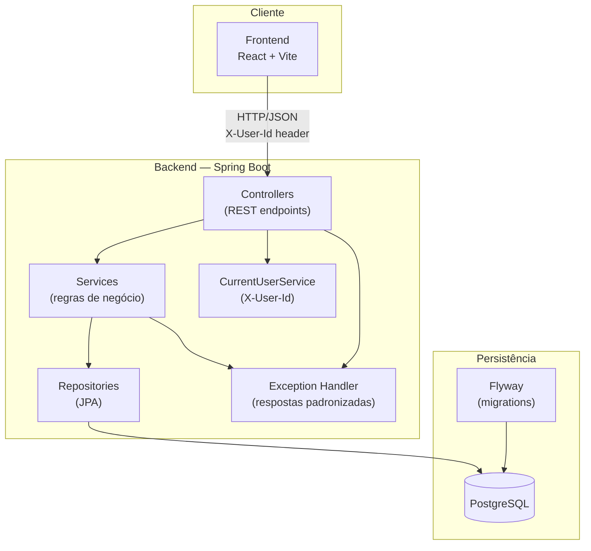

# Arquitetura — ProjetoLBC

Este documento descreve a arquitetura geral do Sistema de Gestão de Férias, incluindo camadas, responsabilidades e mecanismo de autenticação simulada.

## Visão geral

O ProjetoLBC é um monorepo full-stack composto por:

- **Backend:** API REST em Java 21 com Spring Boot
- **Frontend:** SPA em React com Vite
- **Banco de dados:** PostgreSQL com migrations gerenciadas pelo Flyway
- **Infraestrutura:** Docker e docker-compose para orquestração local

A comunicação entre frontend e backend ocorre via HTTP/JSON. A documentação interativa da API é exposta via Swagger/OpenAPI.

## Diagrama de arquitetura



## Camadas e responsabilidades

### Controller

- Expõe endpoints REST
- Recebe e valida DTOs de entrada (`@Valid`)
- Delega lógica de negócio ao service
- Retorna DTOs de resposta com códigos HTTP apropriados
- Não contém regras de negócio

**Exemplos:** `EmployeeController`, `VacationRequestController`

### Service

- Implementa regras de negócio e orquestração
- Valida permissões por role (ADMIN, MANAGER, COLLABORATOR)
- Executa validação global de overlap de férias
- Coordena transações
- Converte entre entity e DTO via mapper

**Exemplos:** `EmployeeService`, `VacationRequestService`, `CurrentUserService`

### Repository

- Interface JPA para acesso ao banco de dados
- Queries customizadas (ex.: overlap de férias)
- Sem lógica de negócio

**Exemplos:** `EmployeeRepository`, `VacationRequestRepository`

### Entity

- Mapeamento JPA das tabelas do banco
- Relacionamentos entre entidades
- Enums persistidos (Role, VacationStatus)

**Exemplos:** `Employee`, `VacationRequest`

### DTO (Data Transfer Object)

- Objetos de transferência entre camadas e API
- Separa contrato externo do modelo interno
- Request DTOs: `CreateEmployeeRequest`, `UpdateEmployeeRequest`, `CreateVacationRequest`, etc.
- Response DTOs: `EmployeeResponse`, `VacationRequestResponse`, etc.

### Mapper

- Converte entity ↔ DTO
- Pode ser implementado manualmente ou com MapStruct
- Centraliza lógica de transformação fora dos services

### Exception

- Exceções de domínio customizadas
- Handler global (`@ControllerAdvice`) mapeia exceções para respostas HTTP padronizadas

**Exemplos:**

| Exceção                    | HTTP Status |
|----------------------------|-------------|
| `ResourceNotFoundException`| 404         |
| `ForbiddenException`       | 403         |
| `BadRequestException`      | 400         |
| `VacationOverlapException` | 409         |

### Config

- Configurações da aplicação
- Interceptor/filter para leitura do header `X-User-Id`
- Configuração do Swagger/OpenAPI
- Configuração CORS para o frontend

## Autenticação simulada com X-User-Id

Nesta fase não há login, JWT ou sessão. O usuário autenticado é identificado pelo header HTTP:

```
X-User-Id: <employee-uuid>
```

### Fluxo

1. Cliente envia requisição com header `X-User-Id`
2. Interceptor/filter extrai o UUID e busca o `Employee` correspondente
3. `CurrentUserService` disponibiliza o colaborador logado e sua `Role`
4. Services consultam `CurrentUserService` para autorização

### Comportamento esperado

| Cenário                          | Resposta |
|----------------------------------|----------|
| Header ausente                   | 401 ou 400 (a definir na implementação) |
| UUID inválido ou inexistente     | 404      |
| Usuário válido, sem permissão    | 403      |

No frontend futuro, um dropdown permitirá alternar o usuário ativo, enviando o UUID correspondente em todas as requisições.

## Matriz de permissões por role

### Colaboradores (Employee)

| Ação                    | ADMIN | MANAGER | COLLABORATOR |
|-------------------------|:-----:|:-------:|:------------:|
| Criar colaborador       | ✅    | ❌      | ❌           |
| Listar colaboradores    | ✅    | ✅*     | ✅*          |
| Ver detalhes            | ✅    | ✅*     | ✅*          |
| Editar colaborador      | ✅    | ❌      | ❌           |
| Remover colaborador     | ✅    | ❌      | ❌           |

\* Escopo de visualização pode ser restrito na implementação (ex.: MANAGER vê apenas subordinados diretos).

### Pedidos de férias (VacationRequest)

| Ação                              | ADMIN | MANAGER | COLLABORATOR |
|-----------------------------------|:-----:|:-------:|:------------:|
| Criar pedido (para si)            | ✅    | ✅      | ✅           |
| Criar pedido (para outro)         | ✅    | ❌      | ❌           |
| Listar pedidos                    | ✅    | ✅*     | ✅*          |
| Ver detalhes                      | ✅    | ✅*     | ✅*          |
| Editar pedido                     | ✅    | ✅*     | ✅*          |
| Cancelar pedido                   | ✅    | ✅*     | ✅*          |
| Aprovar pedido                    | ✅    | ✅*     | ❌           |
| Rejeitar pedido                   | ✅    | ✅*     | ❌           |

\* Apenas pedidos próprios ou de colaboradores diretos (MANAGER).

### Regras adicionais de autorização

- **MANAGER** só aprova/rejeita pedidos de colaboradores que o tenham como manager (`manager_id`)
- **COLLABORATOR** só manipula pedidos em que `employee_id` seja o seu próprio ID
- **ADMIN** tem acesso irrestrito a todas as operações

## Princípios arquiteturais

1. **Separação de responsabilidades:** cada camada tem uma função clara
2. **DTO como contrato da API:** entities não são expostas diretamente
3. **Validação centralizada:** overlap e permissões no service, não no controller
4. **Fail fast:** erros de autorização e validação retornam códigos HTTP semânticos
5. **Preparado para evolução:** autenticação simulada pode ser substituída por JWT sem alterar regras de negócio
