# Diagrama de Classes — ProjetoLBC

Este documento apresenta o diagrama de classes das principais componentes do backend Spring Boot.

## Diagrama de classes

```mermaid
classDiagram
    direction TB

    class Employee {
        +UUID id
        +String name
        +String email
        +Role role
        +Employee manager
        +List~Employee~ subordinates
        +LocalDateTime createdAt
        +LocalDateTime updatedAt
    }

    class VacationRequest {
        +UUID id
        +Employee employee
        +LocalDate startDate
        +LocalDate endDate
        +VacationStatus status
        +String rejectionReason
        +LocalDateTime createdAt
        +LocalDateTime updatedAt
    }

    class Role {
        <<enumeration>>
        ADMIN
        MANAGER
        COLLABORATOR
    }

    class VacationStatus {
        <<enumeration>>
        PENDING
        APPROVED
        REJECTED
        CANCELLED
    }

    class EmployeeController {
        -EmployeeService employeeService
        +create(request) EmployeeResponse
        +findAll() List~EmployeeResponse~
        +findById(id) EmployeeResponse
        +update(id, request) EmployeeResponse
        +delete(id) void
    }

    class VacationRequestController {
        -VacationRequestService vacationRequestService
        +create(request) VacationRequestResponse
        +findAll() List~VacationRequestResponse~
        +findById(id) VacationRequestResponse
        +update(id, request) VacationRequestResponse
        +cancel(id) VacationRequestResponse
        +approve(id) VacationRequestResponse
        +reject(id, request) VacationRequestResponse
    }

    class EmployeeService {
        -EmployeeRepository employeeRepository
        -EmployeeMapper employeeMapper
        -CurrentUserService currentUserService
        +create(request) EmployeeResponse
        +findAll() List~EmployeeResponse~
        +findById(id) EmployeeResponse
        +update(id, request) EmployeeResponse
        +delete(id) void
    }

    class VacationRequestService {
        -VacationRequestRepository vacationRequestRepository
        -EmployeeRepository employeeRepository
        -VacationRequestMapper vacationRequestMapper
        -CurrentUserService currentUserService
        +create(request) VacationRequestResponse
        +findAll() List~VacationRequestResponse~
        +findById(id) VacationRequestResponse
        +update(id, request) VacationRequestResponse
        +cancel(id) VacationRequestResponse
        +approve(id) VacationRequestResponse
        +reject(id, request) VacationRequestResponse
        -validateOverlap(start, end, excludeId) void
        -validatePermission(action, request) void
    }

    class CurrentUserService {
        -EmployeeRepository employeeRepository
        +getCurrentEmployee() Employee
        +getCurrentRole() Role
        +requireRole(roles) void
        +isManagerOf(employee) boolean
    }

    class EmployeeRepository {
        <<interface>>
        +findByEmail(email) Optional~Employee~
        +findByManagerId(managerId) List~Employee~
    }

    class VacationRequestRepository {
        <<interface>>
        +existsOverlapping(start, end, excludeId) boolean
        +findByEmployeeId(employeeId) List~VacationRequest~
        +findByStatusIn(statuses) List~VacationRequest~
    }

    class CreateEmployeeRequest {
        +String name
        +String email
        +Role role
        +UUID managerId
    }

    class UpdateEmployeeRequest {
        +String name
        +String email
        +Role role
        +UUID managerId
    }

    class EmployeeResponse {
        +UUID id
        +String name
        +String email
        +Role role
        +UUID managerId
        +String managerName
        +LocalDateTime createdAt
        +LocalDateTime updatedAt
    }

    class CreateVacationRequest {
        +UUID employeeId
        +LocalDate startDate
        +LocalDate endDate
    }

    class UpdateVacationRequest {
        +LocalDate startDate
        +LocalDate endDate
    }

    class RejectVacationRequest {
        +String rejectionReason
    }

    class VacationRequestResponse {
        +UUID id
        +UUID employeeId
        +String employeeName
        +LocalDate startDate
        +LocalDate endDate
        +VacationStatus status
        +String rejectionReason
        +LocalDateTime createdAt
        +LocalDateTime updatedAt
    }

    class EmployeeMapper {
        <<interface>>
        +toEntity(request) Employee
        +toResponse(entity) EmployeeResponse
        +updateEntity(entity, request) void
    }

    class VacationRequestMapper {
        <<interface>>
        +toEntity(request, employee) VacationRequest
        +toResponse(entity) VacationRequestResponse
        +updateEntity(entity, request) void
    }

    class ResourceNotFoundException {
        +String message
    }

    class ForbiddenException {
        +String message
    }

    class BadRequestException {
        +String message
    }

    class VacationOverlapException {
        +String message
    }

    class GlobalExceptionHandler {
        +handleNotFound(ex) ErrorResponse
        +handleForbidden(ex) ErrorResponse
        +handleBadRequest(ex) ErrorResponse
        +handleOverlap(ex) ErrorResponse
    }

    Employee --> Role
    Employee --> Employee : manager
    VacationRequest --> Employee
    VacationRequest --> VacationStatus

    EmployeeController --> EmployeeService
    VacationRequestController --> VacationRequestService

    EmployeeService --> EmployeeRepository
    EmployeeService --> EmployeeMapper
    EmployeeService --> CurrentUserService

    VacationRequestService --> VacationRequestRepository
    VacationRequestService --> EmployeeRepository
    VacationRequestService --> VacationRequestMapper
    VacationRequestService --> CurrentUserService

    CurrentUserService --> EmployeeRepository

    EmployeeMapper ..> CreateEmployeeRequest
    EmployeeMapper ..> UpdateEmployeeRequest
    EmployeeMapper ..> EmployeeResponse
    EmployeeMapper ..> Employee

    VacationRequestMapper ..> CreateVacationRequest
    VacationRequestMapper ..> UpdateVacationRequest
    VacationRequestMapper ..> VacationRequestResponse
    VacationRequestMapper ..> VacationRequest

    GlobalExceptionHandler ..> ResourceNotFoundException
    GlobalExceptionHandler ..> ForbiddenException
    GlobalExceptionHandler ..> BadRequestException
    GlobalExceptionHandler ..> VacationOverlapException
```



## Descrição das classes principais

### Entidades

| Classe            | Responsabilidade                                      |
|-------------------|-------------------------------------------------------|
| `Employee`        | Colaborador com role e relação hierárquica (manager)  |
| `VacationRequest` | Pedido de férias vinculado a um colaborador           |

### Enums

| Enum              | Valores                                      |
|-------------------|----------------------------------------------|
| `Role`            | ADMIN, MANAGER, COLLABORATOR                 |
| `VacationStatus`  | PENDING, APPROVED, REJECTED, CANCELLED       |

### Controllers

| Classe                      | Base path (previsto)     |
|-----------------------------|--------------------------|
| `EmployeeController`        | `/api/employees`         |
| `VacationRequestController` | `/api/vacation-requests` |

### Services

| Classe                    | Responsabilidade principal                          |
|---------------------------|-----------------------------------------------------|
| `EmployeeService`         | CRUD de colaboradores (somente ADMIN)               |
| `VacationRequestService`  | Ciclo de vida dos pedidos + overlap + permissões    |
| `CurrentUserService`      | Resolve usuário logado via header `X-User-Id`       |

### Repositories

| Classe                      | Método customizado relevante                    |
|-----------------------------|-------------------------------------------------|
| `EmployeeRepository`        | `findByManagerId` — subordinados do MANAGER     |
| `VacationRequestRepository` | `existsOverlapping` — validação global          |

### DTOs

| DTO                       | Uso                          |
|---------------------------|------------------------------|
| `CreateEmployeeRequest`   | POST /api/employees          |
| `UpdateEmployeeRequest`   | PUT /api/employees/{id}      |
| `EmployeeResponse`          | Resposta de endpoints Employee |
| `CreateVacationRequest`   | POST /api/vacation-requests  |
| `UpdateVacationRequest`   | PUT /api/vacation-requests/{id} |
| `RejectVacationRequest`   | POST /api/vacation-requests/{id}/reject |
| `VacationRequestResponse` | Resposta de endpoints VacationRequest |

### Mappers

Convertem entre DTOs e entities, mantendo services focados em regras de negócio. Implementação sugerida: MapStruct ou mappers manuais com `@Component`.

### Exceptions

Todas tratadas centralmente por `GlobalExceptionHandler` (`@ControllerAdvice`), retornando JSON padronizado:

```json
{
  "timestamp": "2026-05-28T10:00:00",
  "status": 409,
  "error": "Conflict",
  "message": "Vacation period overlaps with an existing request"
}
```
