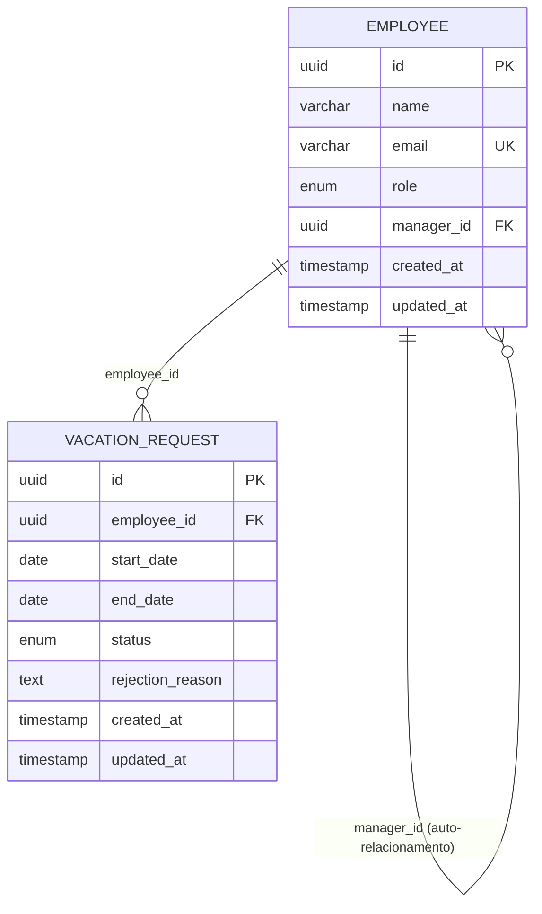

# Modelo de Dados — ProjetoLBC

Este documento descreve o schema do banco de dados PostgreSQL, entidades, enums, índices e a query de validação global de overlap.

## Diagrama ER



## Entidade Employee

Representa um colaborador do sistema.

| Coluna       | Tipo         | Restrições              | Descrição                              |
|--------------|--------------|-------------------------|----------------------------------------|
| id           | UUID         | PK, NOT NULL            | Identificador único                    |
| name         | VARCHAR(255) | NOT NULL                | Nome completo                          |
| email        | VARCHAR(255) | NOT NULL, UNIQUE        | E-mail corporativo                     |
| role         | VARCHAR(20)  | NOT NULL                | ADMIN, MANAGER ou COLLABORATOR         |
| manager_id   | UUID         | FK → employee(id), NULL | Manager direto (nullable)              |
| created_at   | TIMESTAMP    | NOT NULL                | Data de criação                        |
| updated_at   | TIMESTAMP    | NOT NULL                | Data da última atualização             |

### Relacionamento manager

- Um colaborador pode ter zero ou um manager (`manager_id` nullable)
- Um MANAGER ou ADMIN pode ser manager de vários colaboradores
- Auto-relacionamento: `employee.manager_id → employee.id`
- COLLABORATORs tipicamente possuem `manager_id` preenchido
- ADMIN pode não ter manager

## Entidade VacationRequest

Representa um pedido de férias.

| Coluna           | Tipo         | Restrições              | Descrição                              |
|------------------|--------------|-------------------------|----------------------------------------|
| id               | UUID         | PK, NOT NULL            | Identificador único                    |
| employee_id      | UUID         | FK → employee(id), NOT NULL | Colaborador solicitante            |
| start_date       | DATE         | NOT NULL                | Data de início (inclusiva)             |
| end_date         | DATE         | NOT NULL                | Data de fim (inclusiva)                |
| status           | VARCHAR(20)  | NOT NULL                | PENDING, APPROVED, REJECTED, CANCELLED |
| rejection_reason | TEXT         | NULL                    | Motivo da rejeição (quando REJECTED)   |
| created_at       | TIMESTAMP    | NOT NULL                | Data de criação                        |
| updated_at       | TIMESTAMP    | NOT NULL                | Data da última atualização             |

### Constraints de negócio (nível aplicação e/ou banco)

- `start_date <= end_date`
- Apenas pedidos PENDING ou APPROVED participam da validação de overlap
- REJECTED e CANCELLED não bloqueiam o calendário

## Enums

### Role

| Valor        | Descrição                                              |
|--------------|--------------------------------------------------------|
| ADMIN        | Administrador com acesso total                         |
| MANAGER      | Gerente de equipe; aprova férias de subordinados       |
| COLLABORATOR | Colaborador comum; gerencia apenas seus pedidos        |

Persistência sugerida: `VARCHAR` ou tipo enum nativo PostgreSQL.

### VacationStatus

| Valor     | Descrição                                      | Bloqueia calendário |
|-----------|------------------------------------------------|---------------------|
| PENDING   | Aguardando aprovação                           | ✅ Sim              |
| APPROVED  | Aprovado                                       | ✅ Sim              |
| REJECTED  | Rejeitado                                      | ❌ Não              |
| CANCELLED | Cancelado pelo solicitante ou ADMIN            | ❌ Não              |

## Índices recomendados

```sql
-- Busca por e-mail (unicidade já cria índice implícito)
CREATE UNIQUE INDEX idx_employee_email ON employee (email);

-- Listagem de subordinados por manager
CREATE INDEX idx_employee_manager_id ON employee (manager_id);

-- Pedidos por colaborador
CREATE INDEX idx_vacation_request_employee_id ON vacation_request (employee_id);

-- Validação de overlap: filtro por status + intervalo de datas
CREATE INDEX idx_vacation_request_status_dates
    ON vacation_request (status, start_date, end_date);

-- Listagem por status
CREATE INDEX idx_vacation_request_status ON vacation_request (status);
```

O índice composto `(status, start_date, end_date)` é o mais relevante para a query de overlap, pois filtra primeiro por status ativo e depois avalia o intervalo.

## Regra de datas inclusivas

Quando um pedido vai de `2026-06-01` a `2026-06-05`, ambas as datas são dias de férias. O colaborador está ausente nos dias 01, 02, 03, 04 e 05.

Dois intervalos `[startA, endA]` e `[startB, endB]` se sobrepõem quando:

```
startA <= endB AND startB <= endA
```

### Exemplos

| Intervalo A       | Intervalo B       | Sobrepõe? | Motivo                          |
|-------------------|-------------------|:---------:|---------------------------------|
| 01/06 – 05/06     | 05/06 – 10/06     | ✅        | Dia 05 pertence a ambos         |
| 01/06 – 05/06     | 06/06 – 10/06     | ❌        | Adjacentes, sem dia em comum    |
| 01/06 – 10/06     | 03/06 – 07/06     | ✅        | B está contido em A             |
| 01/06 – 05/06     | 01/06 – 05/06     | ✅        | Intervalos idênticos            |

## Query conceitual de validação global de overlap

A validação é **global**: não filtra por `employee_id`. Dois colaboradores diferentes não podem ter pedidos ativos (PENDING ou APPROVED) com datas sobrepostas.

```sql
SELECT EXISTS (
    SELECT 1
    FROM vacation_request vr
    WHERE vr.status IN ('PENDING', 'APPROVED')
      AND vr.id <> :requestId          -- excluir o próprio registro em updates
      AND vr.start_date <= :endDate
      AND :startDate <= vr.end_date
);
```

### Parâmetros

| Parâmetro   | Descrição                                           |
|-------------|-----------------------------------------------------|
| `:startDate`| Data de início do pedido sendo criado/editado       |
| `:endDate`  | Data de fim do pedido sendo criado/editado          |
| `:requestId`| ID do pedido atual (NULL em criação)                |

### Quando executar

- **Criação** de pedido: `:requestId` = NULL
- **Edição** de pedido (datas ou reativação): excluir o próprio ID
- **Aprovação:** revalidar overlap antes de mudar status para APPROVED

### Resultado

- `EXISTS = true` → conflito → HTTP 409 (Conflict)
- `EXISTS = false` → intervalo livre → prosseguir

## Migrations Flyway (previstas)

| Arquivo                              | Conteúdo                              |
|--------------------------------------|---------------------------------------|
| `V1__create_employee_table.sql`      | Tabela employee + índices             |
| `V2__create_vacation_request_table.sql` | Tabela vacation_request + FK + índices |

Nomenclatura Flyway: `V{versão}__{descrição}.sql`

## Seed data (opcional, fase posterior)

Dados iniciais para desenvolvimento e testes:

- 1 ADMIN
- 1 MANAGER com 2–3 COLLABORATORs subordinados
- 1 COLLABORATOR sem manager (edge case)
- Pedidos de exemplo em diferentes status
