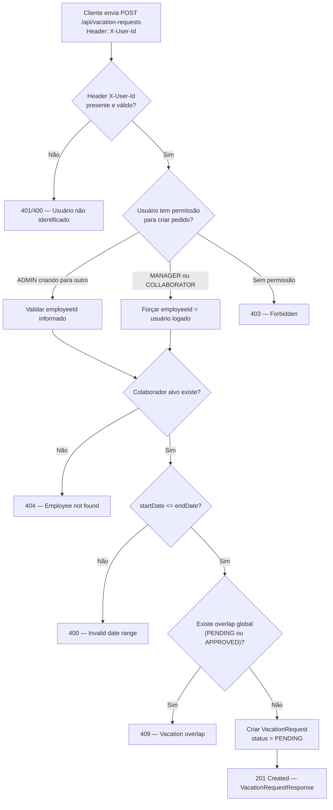
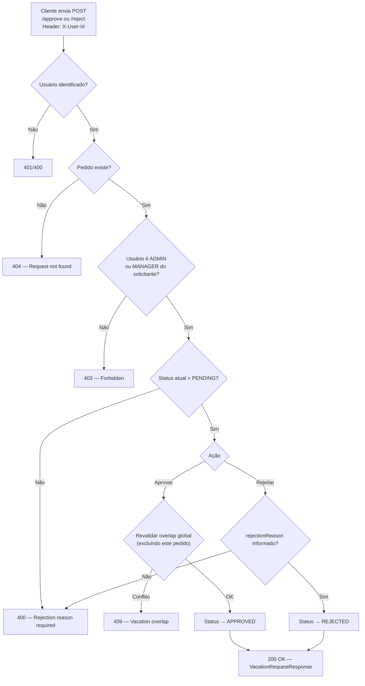
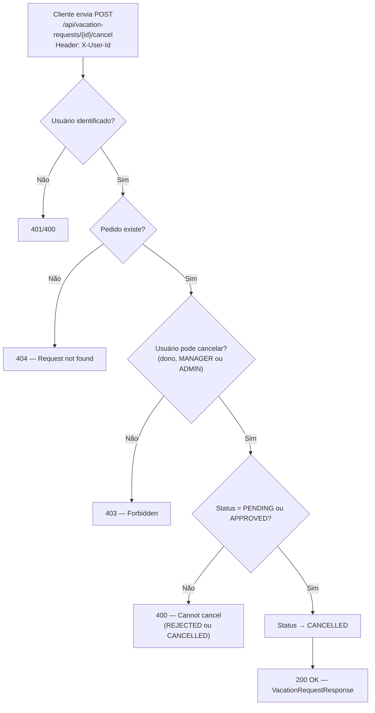
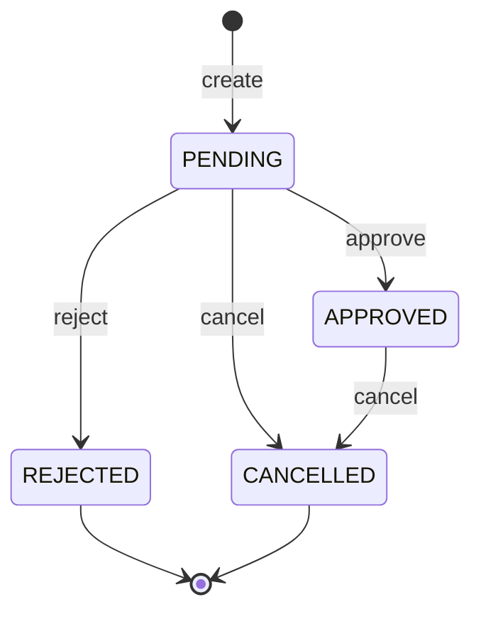

# Fluxos — ProjetoLBC

Este documento descreve os fluxos principais de negócio e os cenários de erro da API.

## Fluxo: criação de pedido de férias

### Regras aplicadas neste fluxo

- ADMIN pode informar qualquer `employeeId`
- MANAGER e COLLABORATOR só criam para si mesmos
- Overlap é verificado globalmente, sem filtro por colaborador
- Novo pedido sempre inicia com status PENDING

---

## Fluxo: aprovação / rejeição de pedido

### Observações

- Apenas ADMIN e MANAGER (do colaborador solicitante) podem aprovar/rejeitar
- COLLABORATOR não tem essa permissão
- Na aprovação, o overlap é revalidado para evitar race conditions
- Rejeição exige `rejectionReason` no body

---

## Fluxo: cancelamento de pedido

### Regras de cancelamento

| Status atual | Pode cancelar? |
|:------------:|:--------------:|
| PENDING      | ✅             |
| APPROVED     | ✅             |
| REJECTED     | ❌             |
| CANCELLED    | ❌             |

Quem pode cancelar:

- O próprio solicitante (COLLABORATOR ou MANAGER)
- MANAGER do solicitante
- ADMIN

---

## Cenários de erro HTTP

### 400 — Bad Request

Requisição inválida ou violação de regra de negócio que não envolve conflito de recursos.

| Cenário                                      | Exemplo de mensagem                          |
|----------------------------------------------|----------------------------------------------|
| `startDate` posterior a `endDate`            | Invalid date range                           |
| Tentativa de aprovar pedido não-PENDING      | Invalid status transition                    |
| Rejeição sem `rejectionReason`               | Rejection reason is required                 |
| Cancelamento de pedido REJECTED/CANCELLED    | Cannot cancel request in current status      |
| Body com campos inválidos (`@Valid`)         | Validation failed for field 'email'          |
| Header `X-User-Id` ausente (se 400)          | X-User-Id header is required                 |

### 403 — Forbidden

Usuário autenticado (identificado) sem permissão para a operação.

| Cenário                                      | Exemplo de mensagem                          |
|----------------------------------------------|----------------------------------------------|
| COLLABORATOR tentando criar colaborador      | Access denied                                |
| MANAGER tentando aprovar pedido de outro time| Access denied                                |
| COLLABORATOR tentando editar pedido alheio   | Access denied                                |
| MANAGER tentando criar pedido para subordinado | Access denied                              |

### 404 — Not Found

Recurso referenciado não existe.

| Cenário                                      | Exemplo de mensagem                          |
|----------------------------------------------|----------------------------------------------|
| `X-User-Id` com UUID inexistente             | Employee not found                           |
| Pedido de férias inexistente                 | Vacation request not found                   |
| `employeeId` informado não encontrado        | Employee not found                           |
| Colaborador em GET/PUT/DELETE inexistente    | Employee not found                           |

### 409 — Conflict

Conflito com estado existente no sistema.

| Cenário                                      | Exemplo de mensagem                          |
|----------------------------------------------|----------------------------------------------|
| Overlap global na criação                    | Vacation period overlaps with existing request |
| Overlap global na edição de datas            | Vacation period overlaps with existing request |
| Overlap na aprovação (race condition)        | Vacation period overlaps with existing request |
| E-mail duplicado ao criar/editar colaborador | Email already in use                         |

---

## Transições de status permitidas

| De        | Para      | Ação     | Quem pode executar              |
|-----------|-----------|----------|---------------------------------|
| —         | PENDING   | create   | ADMIN, MANAGER*, COLLABORATOR*  |
| PENDING   | APPROVED  | approve  | ADMIN, MANAGER**                |
| PENDING   | REJECTED  | reject   | ADMIN, MANAGER**                |
| PENDING   | CANCELLED | cancel   | dono, MANAGER**, ADMIN          |
| APPROVED  | CANCELLED | cancel   | dono, MANAGER**, ADMIN          |

\* MANAGER e COLLABORATOR apenas para si mesmos.
\*\* MANAGER apenas para subordinados diretos.
