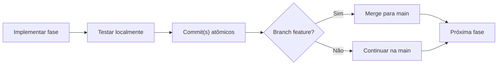

# Estratégia Git — ProjetoLBC

Este documento define a estratégia de versionamento, convenções de commit e plano de entregas por fase.

## Modelo de branching

Estratégia **trunk-based simplificada** para teste técnico:

```
main (branch principal, sempre deployável)
  └── feature/* (branches de curta duração por fase ou funcionalidade)
```

### Regras

1. `main` é a branch principal e reflete o estado estável do projeto
2. Cada fase ou funcionalidade relevante pode usar uma branch `feature/` temporária
3. Merge para `main` via pull request (ou merge direto em contexto solo)
4. Commits pequenos, atômicos e com mensagens descritivas
5. Não usar force push em `main`

### Nomenclatura de branches

```
feature/phase-2-backend-entities
feature/phase-3-vacation-service
feature/phase-4-frontend-setup
feature/phase-5-docker
```

## Conventional Commits

Seguir a especificação [Conventional Commits](https://www.conventionalcommits.org/):

```
<type>(<optional scope>): <description>

[optional body]

[optional footer]
```

### Types permitidos

| Type       | Uso                                              |
|------------|--------------------------------------------------|
| `feat`     | Nova funcionalidade                              |
| `fix`      | Correção de bug                                  |
| `docs`     | Alteração apenas em documentação                 |
| `chore`    | Tarefas de manutenção, setup, configs            |
| `refactor` | Refatoração sem mudança de comportamento         |
| `test`     | Adição ou correção de testes                     |
| `build`    | Alterações no build system ou dependências       |
| `ci`       | Alterações em pipelines CI                       |

### Scopes sugeridos

`backend`, `frontend`, `docker`, `docs`, `db`

### Exemplos

```
feat(backend): add vacation overlap validation
fix(backend): reject approval when global overlap exists
docs: update architecture diagram
chore(docker): add docker-compose with postgres service
test(backend): add unit tests for VacationRequestService
```

## Plano de commits por fase

### Fase 1 — Estrutura e documentação

```
chore: initialize monorepo and project documentation
```

Arquivos incluídos:
- `.gitignore`
- `README.md`
- `backend/.gitkeep`
- `frontend/.gitkeep`
- `docs/ARCHITECTURE.md`
- `docs/DATABASE.md`
- `docs/CLASS_DIAGRAM.md`
- `docs/FLOWS.md`
- `docs/GIT_STRATEGY.md`

---

### Fase 2 — Backend: fundação

```
chore(backend): initialize spring boot project with java 21
feat(db): add flyway migrations for employee and vacation_request
feat(backend): add employee and vacation request entities
feat(backend): add jpa repositories with overlap query
chore(backend): configure application properties for postgres
```

---

### Fase 3 — Backend: API e regras de negócio

```
feat(backend): add current user service with X-User-Id header
feat(backend): add employee crud with admin authorization
feat(backend): add vacation request lifecycle endpoints
feat(backend): implement global overlap validation
feat(backend): add global exception handler
feat(backend): configure swagger openapi documentation
test(backend): add service and controller tests
```

---

### Fase 4 — Frontend

```
chore(frontend): initialize react project with vite
feat(frontend): add api client with X-User-Id header
feat(frontend): add user selector dropdown
feat(frontend): add employee management pages
feat(frontend): add vacation request pages
feat(frontend): add approval and rejection flows
```

---

### Fase 5 — Docker e infraestrutura

```
feat(docker): add dockerfile for backend
feat(docker): add dockerfile for frontend
feat(docker): add docker-compose with postgres flyway and services
docs: update readme with docker run instructions
```

---

### Fase 6 — Refinamentos finais

```
test(backend): add integration tests for overlap scenarios
fix(backend): handle edge cases in date validation
feat(frontend): improve error handling and user feedback
docs: finalize project documentation
chore: add seed data for development
```

## Boas práticas

1. **Um commit, uma intenção:** não misturar feature com refactor no mesmo commit
2. **Mensagens em inglês:** corpo do commit em inglês; documentação do projeto em português
3. **Sem datas no commit:** usar Conventional Commits, não `2026-05-28-add-feature`
4. **Commits incrementais:** preferir vários commits pequenos a um commit monolítico
5. **Não commitar secrets:** `.env`, credenciais e senhas ficam fora do repositório
6. **Revisar antes de merge:** garantir que `main` compila e passa nos testes

## Arquivos que nunca devem ser commitados

- `.env` e variantes
- `*.pdf`
- `target/`, `node_modules/`, `dist/`
- Credenciais e tokens
- Dados locais do PostgreSQL (`postgres-data/`)

Esses padrões já estão cobertos pelo `.gitignore` do projeto.

## Workflow recomendado por fase



Para este teste técnico em desenvolvimento solo, commits diretos na `main` são aceitáveis. Branches `feature/` são recomendadas se houver revisão ou se o escopo da fase for grande.
